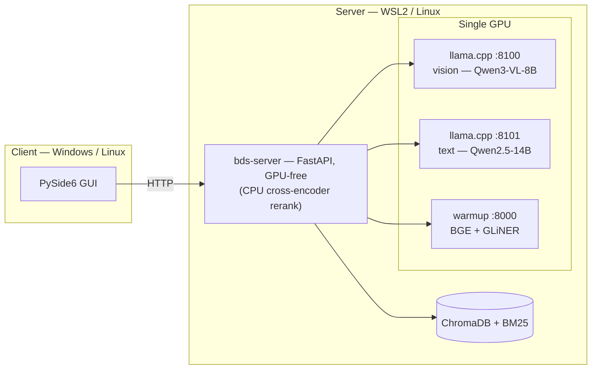
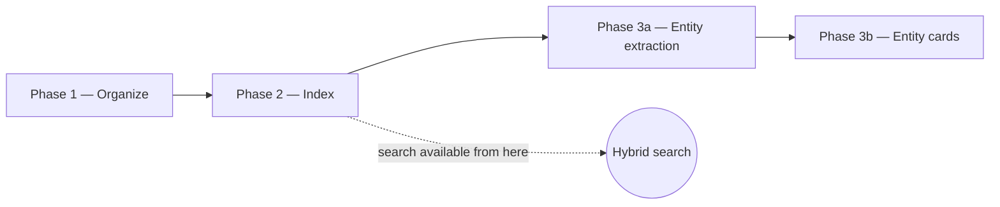
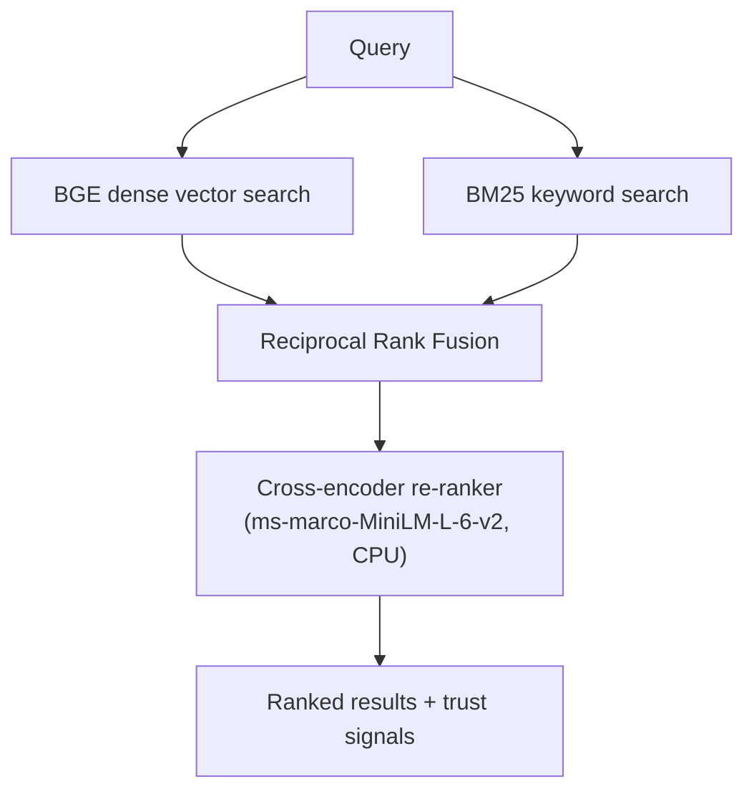

# BDS — Batch Document Search

A private, local platform for researching large document sets: batch ingestion,
hybrid semantic search, entity extraction, and an Obsidian-compatible knowledge
graph. Everything runs on hardware the operator controls — no document ever
leaves the machine.

**Design principle — leads, not conclusions.** Retrieval over a fixed corpus
always returns the *closest* chunks, even when the closest chunks are still far
from the question. A system that hides that fact produces confident, wrong
answers. BDS is built the other way: every result carries signals that tell the
operator when the corpus probably doesn't contain a real answer, so a gap reads
as a finding rather than a failure.

---

## Architecture

BDS runs single-machine for development or split client/server for production.
The production topology is four long-lived services. Three GPU roles sit behind
two `llama.cpp` servers and one warmup server; the application server itself is
deliberately **GPU-free**, so it's the only service that can hot-restart safely.

The thin client uses the same GUI as single-machine mode but talks to the
server over HTTP instead of importing backend packages directly. A packaged
Windows executable is produced with Nuitka; dependencies are managed with `uv`,
split so client-only machines never pull server-side ML libraries.

## Pipeline

A four-stage pipeline, with entity work split into extraction and synthesis so
the two — which have very different runtime profiles — can be re-run
independently.

1. **Organize** — extract, classify by domain, and file documents.
2. **Index** — chunk (1000 / 200 overlap) and index into ChromaDB and BM25. Search works from here.
3. **Entity extraction** — zero-shot NER with dedup and noise suppression.
4. **Entity cards** — LLM-summarized entity profiles written as a knowledge graph.

Document extraction is a three-tier pipeline with automatic fallback: a native
text-layer pass, an EasyOCR mid-tier pass when the text layer is thin, and a
vision-LLM pass for image-heavy pages. Results are cached as sidecars so re-runs
only process what's new.

## Hybrid retrieval

Dense and keyword retrieval are fused by Reciprocal Rank Fusion, then a
cross-encoder re-ranks the pool by scoring each *(query, chunk)* pair jointly —
so the final order reflects how well a chunk *answers* the question, not just
how similar it looks. A high-similarity chunk can correctly rank below one that
simply answers better.

## Trust signals

Every result row carries three honesty markers:

- **Channel** — whether a chunk was found by vector, keyword, or both. A
  keyword-only hit with no semantic neighbor is often the shape of an off-topic
  match.
- **Result Critic** — a heuristic (no LLM call) that raises a banner when the
  retrieval shape suggests the corpus may not answer the query (weak top match,
  all-keyword results, or single-source narrowness).
- **RAG citation** — a per-row marker showing whether the synthesized answer
  actually grounded in that row. An ungrounded answer over weak context is
  visible rather than hidden.

## Knowledge graph

Zero-shot NER (GLiNER) feeds a pass of deterministic dedup, corpus-calibrated
noise suppression, and **subject-anchor protection** — operator-named entities
central to an investigation are never merged away, and if a configured anchor
never appears in the corpus it's surfaced as an explicit zero-mention
placeholder instead of being silently dropped. Output is an Obsidian-compatible
vault of wikilinked entity cards (summary, key facts, relationships, sources). A
final integrity pass reconciles every wikilink against the on-disk card set;
**98.2% repair** on a 100-document public Boeing / NTSB benchmark set.

## Models & serving

Five models across three GPU roles and two CPU roles, on a single GPU:

| Role | Model | Host | VRAM |
|---|---|---|---|
| Vision OCR (image pages) | Qwen3-VL-8B-Instruct · GGUF Q8_0 | llama.cpp, pinned · :8100 | 8.2 GB |
| Synthesis — cards, RAG, wikilink-QA, OSINT validation | Qwen2.5-14B-Instruct · GGUF Q6_K | llama.cpp, pinned · :8101 | 12 GB |
| Dense embeddings | BGE-large-en-v1.5 | warmup server, GPU · :8000 | 1.3 GB |
| Zero-shot NER | GLiNER-medium-v2.1 | warmup server, GPU (lazy) · :8000 | 0.75 GB |
| Cross-encoder rerank | ms-marco-MiniLM-L-6-v2 | bds-server, CPU | 0 |

Plus CPU helpers: EasyOCR (mid-tier OCR) and spaCy `en_core_web_sm` (noun-chunks
in extraction).

Both LLMs stay **pinned and resident simultaneously** — there is no model-swap
path, which is the single most important reliability decision in the system. The
warmup server hosts BGE and GLiNER in one shared CUDA context, and `bds-server`
runs GPU-free (its only GPU need, reranking, is offloaded to CPU) so it can be
restarted without disturbing any resident model. The full inference-topology
rationale is its own [case study](../inference/).

## Selected results

| Metric | Value |
|---|---|
| Wikilink-integrity repair (100-doc baseline) | 98.2% |
| Resident VRAM, flat across all phases | ~28–30 GB (~60%), ~17–19 GB headroom |
| Full pipeline, ~100 docs / ~97k chunks | ~6–7 hr end to end |
| Retrieval-precision plateau | ~60 on-topic documents per query |
