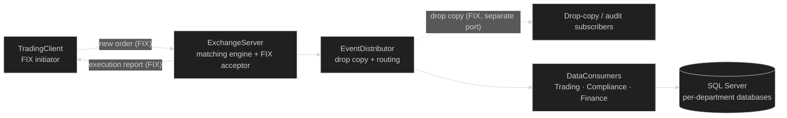

# ExchangeSimulator — FIX Matching Engine in Modern C++20

A full-stack financial exchange simulation in C++20 that models the entire
lifecycle of a trade — from **FIX order entry**, through a **matching engine**
and **execution**, to **drop-copy distribution** and **departmental database
persistence**. It speaks **FIX 5.0 SP2** over **FIXT.1.1** transport via the
Fix8 engine.

This is the "root" side of my work: the low-level systems and
financial-infrastructure engineering that two decades of systematic
trading-systems development was built on — rebuilt here in modern C++.

---

## Trade lifecycle

A trade enters as a FIX message from the client initiator, is matched and filled
by the exchange server's matching engine, and the resulting executions fan out
two ways: back to the client as FIX execution reports, and into the
EventDistributor, which publishes a drop copy on a separate FIX port and routes
events to the departmental consumers for persistence.

## Components

Modular C++ components that communicate through message queues and FIX sessions:

| Component | Role |
|---|---|
| `Common` | Shared types, message definitions, logger, database schemas |
| `Fix8Generated` | Auto-generated FIX 5.0 SP2 message classes (from the `f8c` compiler) |
| `Fix8Adapter` | FIX ⇄ internal order/execution mapping |
| `Fix8SessionManager` | FIX session lifecycle — server acceptor and client initiator |
| `ExchangeServer` | Order matching engine, execution generation, FIX acceptor |
| `TradingClient` | FIX initiator for order entry and execution feedback |
| `EventDistributor` | Drop-copy publishing and departmental event routing |
| `DataConsumers` | Trading, Compliance, and Finance consumption pipelines |
| `DatabaseIntegration` | SQL Server ODBC persistence layer |

## FIX protocol layer

FIX 5.0 SP2 messages are generated from schema into typed C++ classes by the
Fix8 compiler, so the wire protocol is statically typed rather than
string-parsed. An adapter layer maps between FIX messages and the engine's
internal order/execution types, and a session manager owns the full FIX session
lifecycle for both sides — the server's acceptor and the client's initiator.
Drop copy is published on its own FIX port, mirroring how a real venue feeds
compliance and audit consumers out-of-band from the trading path.

## Departmental consumption

Executions are routed by the EventDistributor to three independent consumer
pipelines — **Trading, Compliance, Finance** — each persisting to its own SQL
Server database through an ODBC layer. Separating the consumers this way mirrors
the real organizational boundaries inside an exchange and keeps each department's
persistence independent.

## Modern C++20 and correctness

Correctness is built into the toolchain, not bolted on afterward:

- **C++20 throughout** — `-std=c++20`, coroutines (`-fcoroutines`), `-Wall -Wextra`.
- **Four build types, each with a purpose:** Debug with **AddressSanitizer**
  (catches memory errors during development), a dedicated **ThreadSanitizer**
  build for concurrency testing, Dev (`-O2`, no sanitizer overhead), and
  **Release** (`-O3 -flto`, link-time optimization).
- **Modular, dependency-checked Makefile build** — libraries before
  executables, parallel where dependency-safe, with a system-dependency
  verification target.

The sanitizer-and-thread-safety emphasis is the same "prove it's correct,
structurally" discipline that ran through my trading-systems work — here it's
ASan/TSan and FIX session conformance instead of cross-team re-implementation,
but the instinct is identical.

## Control GUI

A Python/Tkinter process manager makes the whole system drivable without a
terminal:

- **Process control** — start/stop individual executables or the whole system.
- **Order entry** — market, limit, and **batch orders from 5 up to 10,000** for
  load testing the matching path.
- **Log viewer** — tabbed, real-time, with level (ERROR/WARN/INFO/DEBUG) and
  component filtering plus search.
- **Build toggle** — switch between debug and release binaries.

## Stack

C++20 · FIX 5.0 SP2 · Fix8 1.4.3 (FIXT.1.1 transport) · Poco · Boost · OpenSSL
(TLS) · unixODBC + ODBC Driver 17 · SQL Server · Python / Tkinter · GCC 11+ ·
Make
