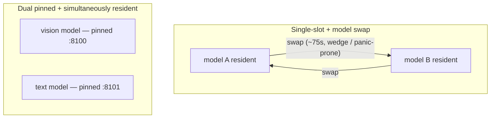

# Inference Backends: vLLM vs. llama.cpp

The problem behind [BDS](../bds/): serve several open-weight models for a
multi-stage document pipeline — vision OCR, text synthesis, RAG, and validation
— on a **single GPU**, under **sustained** load, on a **Windows 10 host running
WSL2 (Ubuntu 24.04)**. The bottleneck that mattered wasn't peak throughput; it
was *stability over hours of continuous inference* without manual intervention.

I benchmarked two backends, vLLM and llama.cpp, and the topology decision ended
up mattering more than the raw token rates.

---

## The failure class that drove the decision

The pipeline needs more than one model resident in different phases (a vision
model for OCR early, a larger text model for synthesis later). A single-slot
server can hold only one at a time, so it has to **swap models** between phases.
Under WSL2, that swap path was the main source of instability: the model-swap
path was prone to **GPU wedges and kernel panics** under sustained load, and
even when healthy it cost real dead time on every phase transition.

The fix was structural rather than a tuning pass: run **two llama.cpp servers,
each pinned to its own model, both resident on the GPU at once**. There is no
swap path in this topology, so the swap-wedge / kernel-panic class becomes
*impossible by construction* — not merely less frequent. The early phase hits
the vision server; the later phase hits the text server; neither evicts the
other.

## Topology

Four long-lived services under `systemd`, each isolated in its own cgroup. The
key asymmetry: every GPU role is offloaded off the application server, so the
application server is **GPU-free and the only one safe to hot-restart**.

| Service | Role | GPU |
|---|---|---|
| llama.cpp (vision) :8100 | OCR on image-heavy pages | yes — pinned |
| llama.cpp (text) :8101 | synthesis, RAG, wikilink-QA, OSINT validation | yes — pinned |
| warmup server :8000 | BGE embeddings + GLiNER NER (one shared CUDA context) | yes |
| bds-server (FastAPI) | orchestration, health, CPU cross-encoder rerank | **no** (`CUDA_VISIBLE_DEVICES=-1`) |

Models are quantized to fit a single GPU with all roles resident at once — GGUF
**Q8_0** for the vision model, **Q6_K** for the larger text model — chosen to
hold quality while leaving headroom for everything to stay pinned.

## VRAM profile

A single ~47.5 GB GPU, with the resident set holding flat across every phase —
there is no per-phase load/unload churn, which is exactly the point.

| Resident model | VRAM |
|---|---|
| Vision — Qwen3-VL-8B (Q8_0) | 8.2 GB |
| Text — Qwen2.5-14B (Q6_K) | 12 GB |
| BGE-large embeddings | 1.3 GB |
| GLiNER NER (lazy, Phase 3a) | 0.75 GB |
| **Total resident** | **~28–30 GB (~60%)**, ~17–19 GB headroom |

The only intra-run change is GLiNER lazy-loading (+0.75 GB) at the extraction
phase; nothing unloads until the run ends. Verified flat on `nvitop` from boot
through extraction.

## Results

| Aspect | vLLM (single-slot + swap) | llama.cpp (dual resident) |
|---|---|---|
| Model residency | one at a time | all roles pinned, simultaneously resident |
| Swap failure class | wedge / kernel-panic prone under sustained WSL2 load | eliminated by construction |
| Phase-transition dead time | ~75 s swap overhead | ~0 |
| Role in final system | kept as documented rollback path | primary topology |

The dual-resident topology removed roughly **75 seconds of swap dead time per
phase transition** and, more importantly, took the wedge / panic class off the
table on the primary path. vLLM stayed in-tree, code-complete-but-idle, as a
documented fallback for reversibility — the decision was "right tool for *this*
workload and environment," not "one backend is better."

## Operational rule

A hard-won deployment constraint falls out of this design: **GPU services
initialize only at boot.** Hot-restarting a GPU service while the others are
resident wedges the GPU, so GPU-service code changes deploy via a full WSL
restart, never a live `systemctl restart`. Only the GPU-free application server
restarts live — which is why pushing its GPU needs (reranking) onto the CPU was
worth it.

## Benchmarking methodology

A separate but related piece of the work was learning to measure this honestly:

- **Separate stable metrics from noisy ones.** At small sample sizes, raw
  entity/mention counts swing wildly between runs of the same topic; binary and
  ratio metrics hold. Don't A/B on the noisy ones.
- **Quantify the plateau.** Retrieval precision for a well-covered query
  plateaus around ~60 on-topic documents — past that, more documents add graph
  richness but not retrieval precision for that query.
- **Characterize stochastic failure modes.** Some model behaviors (e.g.
  occasional language drift in synthesis) are a per-generation roll of the
  dice, not a deterministic function of input size — so the honest fix is
  model-level, not "use more documents."

Every headline figure traces back to a recorded run rather than a one-off
impression.
