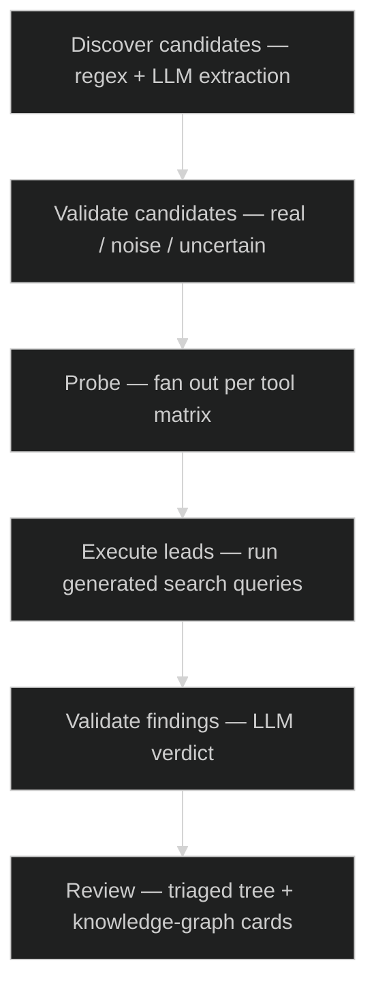
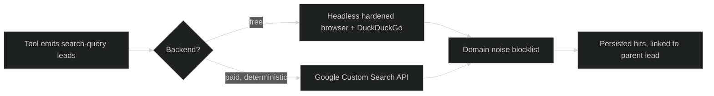

# OSINT Enrichment Subsystem

An optional subsystem layered on the [BDS](../bds/) knowledge base. It pivots
from "this entity appears in your documents" to "this entity has these external
traces" — discovering identifiers in a corpus, validating them, fanning them
across specialist tools, executing the leads those tools generate, and having an
LLM judge each result so the operator sees triaged evidence instead of a wall of
raw search hits.

**Design principle — execute and translate.** Older OSINT tooling dumps raw
search results on the analyst and makes *their* time the bottleneck. This
subsystem inverts that: it **executes** the leads (when a tool emits a search
query as a lead, the system actually runs it and persists the hits) and
**translates** every finding into an operator-readable verdict. The analyst's
job becomes "scan the verdicts," not "read 500 URLs."

---

## Pipeline

Discovery sweeps the corpus for emails, phone numbers, and social handles —
including obfuscated forms an LLM can normalize. An LLM pre-validates each
candidate so downstream probing skips the noise.

## Tool orchestration

A fan-out orchestrator dispatches each candidate to the right specialist tools
by type:

| Candidate type | Tools |
|---|---|
| Email | HOLEHE, theHarvester, EmailRep, Kagi, breach lookup (HIBP) |
| Username | Maigret, Sherlock, WhatsMyName, Wayback (historical handles) |
| Phone | PhoneInfoga (→ search-query lead execution) |
| Name | Maigret, theHarvester, Kagi |

Adapters that aren't configured (e.g. a paid service with no key present)
self-skip before dispatch, so the operator never sees a phantom "tool ran and
returned nothing." Tools that turned out to be silent-failure modes — broken
upstreams or missing binaries — were removed outright rather than left to fail
quietly; an honest "didn't run" beats a misleading empty result.

## Lead execution

Some tools emit *search-query leads* rather than answers. Rather than handing
those URLs to the analyst, the subsystem runs them through a resolvable
backend:

Backend selection is automatic with explicit overrides; a free
fingerprint-resistant-browser path covers low volume, and a paid deterministic
API path covers high volume. A domain blocklist drops known SEO-farm noise
before anything reaches the database, and each executed hit is linked back to
the lead that produced it for full auditability.

## LLM finding-validator

Each executed hit is classified by a local model into a four-state verdict, so
the operator scans color rather than prose:

| Verdict | Meaning |
|---|---|
| **signal** | direct evidence about the target identifier |
| **context** | about the target's organization or domain, not the identifier itself |
| **noise** | SEO page, throwaway account, or a *different* identifier |
| **unknown** | not enough text to judge confidently |

The `context` state was added specifically to stop the validator from flipping
between "signal" and "noise" on organization-adjacent results. The prompt is
tuned to **prefer `unknown` over guessing** — a false "signal" hides a real
noise row from the operator's filters, which is worse than an honest "I can't
tell."

## Findings as a knowledge graph

Validated findings are mirrored back into the Obsidian vault as cards linked to
the entity they enrich, so external traces sit alongside the corpus-derived
profile — with the explicit caveat, carried in the tooling itself, that a
finding is a **lead, not a verified identity link**.

## Engineering notes

- Runs entirely local except the outbound probe/search traffic itself.
- Auto-chaining (discover → validate → probe → execute → validate) is the
  default but every stage has a manual gate.
- Confidence scores are deliberately **not** treated as comparable across tools
  — a registration check and a scraped search hit mean very different things at
  "1.0," and the UI reflects that rather than pretending they're one scale.
